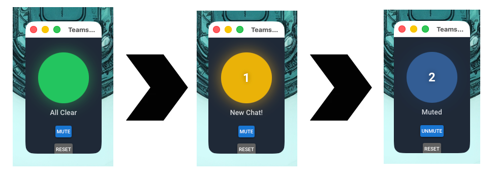
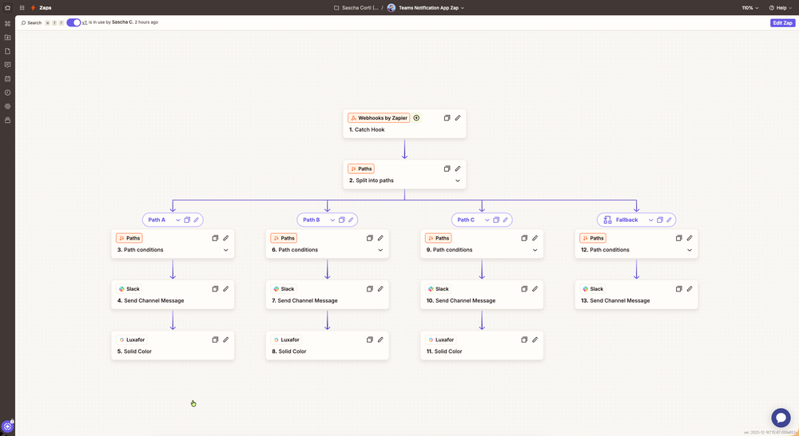

# Teams Notifier 🚨

A macOS alert light application that monitors Microsoft Teams for new chat messages and urgent notifications, providing visual and audio notifications.

## Features

- **Visual Alert Light** - A small, always-on-top window that looks like an alert light
  - 🟢 **Green** = All clear, no pending notifications
  - 🟡 **Yellow (pulsing)** = New chat message
  - 🔴 **Red (flashing)** = Urgent notification (mentions, priority messages)
  - 🔵 **Dark Blue** = Muted (notifications still counted, but no sound/animation)
- **Notification Counter** - Shows the number of pending notifications
- **Sound Alerts** - Different sounds for chat vs urgent notifications
- **Mute Button** - Toggle mute to silence sounds while still tracking notifications
- **Menu Bar Icon** - Quick access from the macOS menu bar
- **Reset Button** - Acknowledge notifications and return to idle state



## Requirements

- macOS 11.0 or later
- Python 3.11+
- Microsoft Teams (running in background)
- Teams notifications enabled in macOS System Settings

## Installation

### Option 1: Run from Source (using uv - Recommended)

[uv](https://docs.astral.sh/uv/) is a fast Python package manager. This is the recommended way to run the project.

1. **Install uv** (if you haven't already):
   ```bash
   curl -LsSf https://astral.sh/uv/install.sh | sh
   ```

2. **Clone the repository and enter the directory**:
   ```bash
   cd /path/to/teams-notifier
   ```

3. **Run the app** (uv will automatically create a venv and install dependencies):
   ```bash
   uv run python -m src.main
   ```

### Option 2: Run from Source (using pip)

1. **Clone the repository** (if you haven't already):
   ```bash
   cd /path/to/Teams/Notifier
   ```

2. **Create and activate virtual environment**:
   ```bash
   python -m venv .venv
   source .venv/bin/activate
   ```

3. **Install dependencies**:
   ```bash
   pip install -r requirements.txt
   ```

4. **Run the app**:
   ```bash
   python -m src.main
   ```

### Option 3: Build macOS App Bundle

Build a proper `.app` you can put in Applications or your Dock:

```bash
# Using uv (recommended)
uv run --group dev ./build.sh

# Or using pip
pip install pyinstaller
./build.sh

# Install to Applications
cp -r "dist/Teams Notifier.app" /Applications/

# Or just run it directly
open "dist/Teams Notifier.app"
```

### Option 4: Quick Launch Script

Double-click `start.command` in Finder to launch without building.

### Permissions Required

Ensure Teams notifications are enabled in macOS:
   - Go to **System Settings** → **Notifications** → **Microsoft Teams**
   - Enable **Allow Notifications**

## Usage

### Normal Mode
Run the notifier to monitor Teams:
```bash
python -m src.main
```

### Demo Mode
Test the UI with simulated notifications:
```bash
python -m src.main --demo
```

## How It Works

The app monitors macOS system logs for Teams notification events using `log stream`. When the NotificationCenter process receives a notification from Teams, this app detects it and:

1. Determines if it's a chat message or urgent notification (based on the sound Teams plays)
2. Updates the visual alert light
3. Plays the appropriate sound
4. Updates the notification count

This approach works reliably with the new Microsoft Teams app (`com.microsoft.teams2`) which uses the User Notifications framework.

## Configuration

### Environment Variables

Configuration is done via a `.env` file. Copy `.env.example` to `.env` and customize:

```bash
cp .env.example .env
```

#### Log Level

Set the logging verbosity:

```dotenv
# Valid values: DEBUG, INFO, WARNING, ERROR, CRITICAL
# Default: INFO
LOG_LEVEL=DEBUG
```

### Code Configuration

Edit `src/config.py` to customize:

```python
# Window size
window_width: int = 150
window_height: int = 200

# Sounds (relative paths from project root, or absolute paths)
chat_sound: str = "resources/audio/GLaDOS-teams-message.wav"
urgent_sound: str = "resources/audio/GLaDOS-teams-urgent.wav"

# Animation speeds (seconds)
pulse_speed: float = 1.0   # Yellow pulsing
flash_speed: float = 0.3   # Red flashing

# Colors (CSS format)
color_idle: str = "#22c55e"    # Green
color_chat: str = "#eab308"    # Yellow  
color_urgent: str = "#ef4444"  # Red
color_muted: str = "#1e3a5f"   # Dark blue (when muted)
```

### Custom Audio Files

Place your own audio files in `resources/audio/` and update the paths in config. Supported formats: `.wav`, `.aiff`, `.mp3`

### Webhook Notifications

The app can send notifications to a webhook URL when alerts are triggered. 

This can be used for example to light up a Luxafor Flag USB notification device or any other notification system that accepts webhook calls.


It can also be used to fire off a Zapier zap.



Configure by creating a `.env` file:

```bash
# Copy the example file
cp .env.example .env

# Edit with your webhook URL
```

```dotenv
# .env
WEBHOOK_URL=https://hooks.zapier.com/hooks/catch/your-id/your-hook/
```

Leave `WEBHOOK_URL` empty or remove it to disable webhooks.

#### Bearer Token Authentication

If your webhook requires authentication, you can configure a bearer token:

```dotenv
# .env
WEBHOOK_URL=https://your-api.example.com/webhook
WEBHOOK_BEARER=your-secret-token-here
```

When `WEBHOOK_BEARER` is set, the app adds an `Authorization: Bearer <token>` header to all webhook requests.

**For the bundled .app**, place the `.env` file in one of these locations (checked in order):
1. Next to the `.app` bundle (e.g., `/Applications/.env` or `~/Desktop/.env`)
2. `~/.config/teams-notifier/.env`
3. `~/.teams-notifier.env`

#### Default Payload

When no custom payloads are configured, the app sends a POST request with this JSON payload:

```json
{
  "type": "message",
  "timestamp": "2025-12-15T14:30:00.123456Z",
  "source": "teams-notifier"
}
```

The `type` field indicates the event:
- `"message"` - New chat message received
- `"urgent"` - Urgent notification (mention or priority message)
- `"clear"` - User pressed the Reset button

#### Custom Payloads

You can configure custom JSON payloads for each notification type. This is useful for integrating with services that expect a specific payload format (e.g., Luxafor, IFTTT, custom APIs).

Add these to your `.env` file:

```dotenv
# Custom payload for regular message notifications
WEBHOOK_PAYLOAD_MESSAGE={"userId": "<your-id>", "actionFields": {"color": "yellow"}}

# Custom payload for urgent/priority notifications
WEBHOOK_PAYLOAD_URGENT={"userId": "<your-id>", "actionFields": {"color": "red"}}

# Custom payload for clear/reset notifications
WEBHOOK_PAYLOAD_CLEAR={"userId": "<your-id>", "actionFields": {"color": "green"}}
```

**Important:** Each payload must be valid JSON on a single line. If a payload is not set or is invalid JSON, the default payload format is used for that notification type.

**Example: Luxafor Integration**

```dotenv
WEBHOOK_URL=https://api.luxafor.com/webhook/v1/actions/solid_color
WEBHOOK_PAYLOAD_MESSAGE={"userId": "your-luxafor-id", "actionFields": {"color": "yellow"}}
WEBHOOK_PAYLOAD_URGENT={"userId": "your-luxafor-id", "actionFields": {"color": "red"}}
WEBHOOK_PAYLOAD_CLEAR={"userId": "your-luxafor-id", "actionFields": {"color": "green"}}
```

**Testing webhooks with curl:**

```bash
# Test message notification (default payload)
curl -X POST "YOUR_WEBHOOK_URL" \
  -H "Content-Type: application/json" \
  -d '{"type": "message", "timestamp": "2025-12-16T14:30:00Z", "source": "teams-notifier"}'

# Test with bearer token authentication
curl -X POST "YOUR_WEBHOOK_URL" \
  -H "Content-Type: application/json" \
  -H "Authorization: Bearer your-secret-token" \
  -d '{"type": "message", "timestamp": "2025-12-16T14:30:00Z", "source": "teams-notifier"}'

# Test with custom Luxafor payload
curl -X POST "https://api.luxafor.com/webhook/v1/actions/solid_color" \
  -H "Content-Type: application/json" \
  -d '{"userId": "your-luxafor-id", "actionFields": {"color": "red"}}'
```

This integrates with services like Zapier, Make, n8n, Luxafor, or any custom webhook endpoint.

### Notification Detection

The app detects notification types based on the sound Teams plays:
- **Urgent sounds** (`b*_teams_urgent_notification_*`) → Red light (URGENT) + `GLaDOS-teams-urgent.wav`
- **Basic sounds** (`a*_teams_basic_notification_*`) → Yellow light (CHAT) + `GLaDOS-teams-message.wav`

This detection is reliable because Teams uses different sound categories for different notification priorities. Mentions and priority notifications use "urgent" sounds, while regular chat messages use "basic" sounds.

### Customizing Sound Detection

If you've changed your Teams notification sounds or if Microsoft updates the sound names, you can configure the patterns used to detect notification types.

**Step 1: Find your Teams sound names**

Run this command in Terminal while receiving Teams notifications:

```bash
log stream --predicate 'process == "NotificationCenter"' | grep -i "Playing notification sound"
```

You'll see output like:
```
Playing notification sound { nam: a8_teams_basic_notification_r4_ping } for com.microsoft.teams2
Playing notification sound { nam: b2_teams_urgent_notification_r4_prioritize } for com.microsoft.teams2
```

The sound name is the value after `nam:` (e.g., `a8_teams_basic_notification_r4_ping`).

**Step 2: Configure the patterns**

Add to your `.env` file:

```dotenv
# Patterns that trigger URGENT (red light) - comma-separated
URGENT_SOUND_PATTERNS=urgent,prioritize,escalate,alarm

# Patterns that trigger CHAT (yellow light) - comma-separated  
CHAT_SOUND_PATTERNS=basic,ping,notify
```

The patterns are **case-insensitive substrings**. If any pattern matches part of the sound name, that classification is used.

**Default patterns:**
- `URGENT_SOUND_PATTERNS`: `urgent,prioritize,escalate,alarm`
- `CHAT_SOUND_PATTERNS`: `basic,ping,notify`

**Example custom configuration:**

If Teams uses sounds like `custom_mention_alert` for urgent notifications:

```dotenv
URGENT_SOUND_PATTERNS=urgent,mention,alert,priority
```

### Available System Sounds

Run this to list available sounds:
```bash
ls /System/Library/Sounds/
```

Common options: `Basso.aiff`, `Blow.aiff`, `Bottle.aiff`, `Frog.aiff`, `Funk.aiff`, `Glass.aiff`, `Hero.aiff`, `Morse.aiff`, `Ping.aiff`, `Pop.aiff`, `Purr.aiff`, `Sosumi.aiff`, `Submarine.aiff`, `Tink.aiff`

## Menu Bar

The app adds an icon to your menu bar:

- 🟢 / 🟡 / 🔴 - Status indicator with count
- **Show Window** - Open the alert light in browser
- **Reset Alerts** - Clear all notifications
- **Sound Enabled** - Toggle sound on/off
- **Quit** - Exit the application

## Troubleshooting

### Notifications not detected

1. **Check Teams notifications are enabled**:
   - macOS: System Settings → Notifications → Microsoft Teams → Allow Notifications
   - Teams: Settings → Notifications → Enable all relevant options

2. **Verify Teams is running**:
   - The app monitors notifications from Teams, so Teams must be running

3. **Check log stream access**:
   - The app uses macOS `log stream` to detect notifications
   - This should work without special permissions on most systems

### No sound

1. Check system volume is not muted
2. Verify sound files exist:
   ```bash
   ls /System/Library/Sounds/
   ```
3. Test sounds manually:
   ```bash
   afplay /System/Library/Sounds/Glass.aiff
   ```

### Window not staying on top

The native window mode may not work on all systems. Try running without native mode by editing `src/main.py` and setting `native=False` in `ui.run()`.

## Development

### Setting up the Development Environment

#### Using uv (Recommended)

```bash
# Install uv if you haven't already
curl -LsSf https://astral.sh/uv/install.sh | sh

# Sync dependencies (creates venv automatically)
uv sync

# Sync with dev dependencies (includes pyinstaller, pytest)
uv sync --group dev

# Run the app
uv run python -m src.main

# Run in demo mode
uv run python -m src.main --demo

# Run tests
uv run pytest tests/

# Build the macOS app bundle
uv run --group dev ./build.sh
```

#### Using pip

```bash
# Create virtual environment
python -m venv .venv
source .venv/bin/activate

# Install dependencies
pip install -r requirements.txt

# Install dev dependencies
pip install pyinstaller pytest
```

### Project Structure

```
src/
├── __init__.py
├── main.py              # Entry point
├── config.py            # Configuration settings
├── ui/
│   ├── __init__.py
│   ├── alert_window.py  # NiceGUI alert light UI
│   └── menu_bar.py      # macOS menu bar integration
├── monitors/
│   ├── __init__.py
│   └── log_stream_monitor.py    # macOS log stream monitor
├── audio/
│   ├── __init__.py
│   └── sound_player.py  # Sound playback
└── webhook/
    ├── __init__.py
    └── sender.py        # Webhook notifications
```

### Running Tests

```bash
pytest tests/
```

## License

MIT License - Feel free to modify and use as needed.
